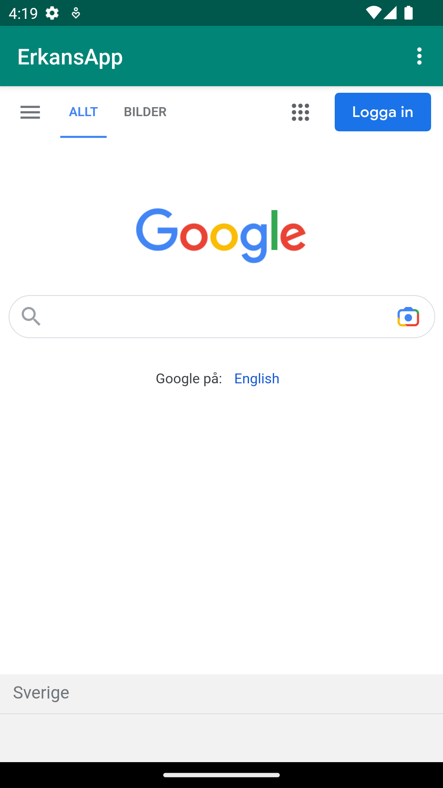
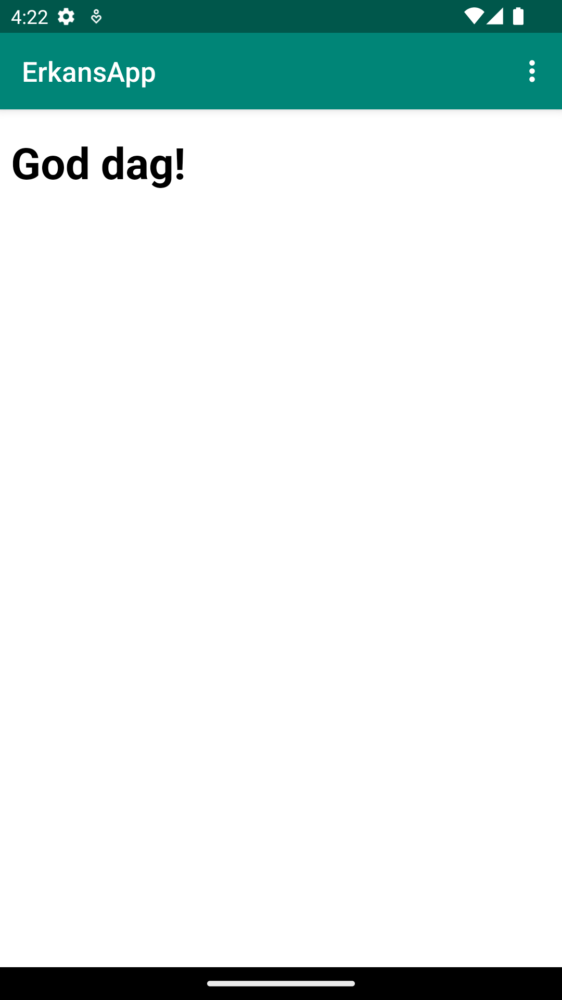

# Rapport

Forkade nya projektet och la sedan in det i android studio genom att clona filerna. Jag bytte namnet på projektet
till "ErkansApp" genom att gå in i "res->values->strings.xml". För att ge appen internetåtkomst
gick jag in på google och hittade kodsnutten "<uses-permission android:name="android.permission.INTERNET"/>" som sedan klistrades in i
"AndroidManifest".

För att implementera ett WebView element skapades först webview i "activity_main" där layouten också anpassades.
Ett id las till för webview i "activity_main" som blev följande "my_webview".
Sedan skapades variabeln "myWebView" i "activity_main" som tilldelades funktionen WebView.
Längre ner i activity_main under "@Override" skrevs id't "my_webview" för att länka samman "WebView" från "activity_main" med
variabeln "myWebView" i "MainActivity" och sedan skapades också en "WebViewClient"(se koden nedan).
android:id="@+id/my_webview"
myWebView = findViewById(R.id.my_webview);
myWebView.setWebViewClient(new WebViewClient());

För att aktivera javascript för WebView implementerades koden nedan i MainActivity
WebSettings webSettings = myWebView.getSettings();
webSettings.setJavaScriptEnabled(true);

Ett html page asset skapades genom att följa instruktionerna som var givna. En assets folder skapades i app mappen. 
Efter det skapades en ny fil i "assets folder" som fick namnet "about.html". 

För att implementera "showExternalWebPage" och "ShowInternalWebPage" skrevs följande kod i MainActivity under "public class":
public void showExternalWebPage(){
myWebView.loadUrl("https://google.com");
}
public void showInternalWebPage(){
myWebView.loadUrl("file:///android_asset/about.html");
}
Sedan för att anropa dessa när man klickar på dropdown menyn så behövde man lägga till "showExternalWebPage()" och
"showInternalWebPage()" längre ner i MainActivity innanför en if-sats som körs om man trycker på dropdown menyn (se koden nedan).
För att se hur internal web page och external webpage ser ut se screenshot 1 och 2 nedan!
if (id == R.id.action_external_web) {
Log.d("==>","Will display external web page");
showExternalWebPage();
return true;
}
if (id == R.id.action_internal_web) {
Log.d("==>","Will display internal web page");
showInternalWebPage();
return true;
}

        return super.onOptionsItemSelected(item);
    }
}

screenshot 1

screenshot 2